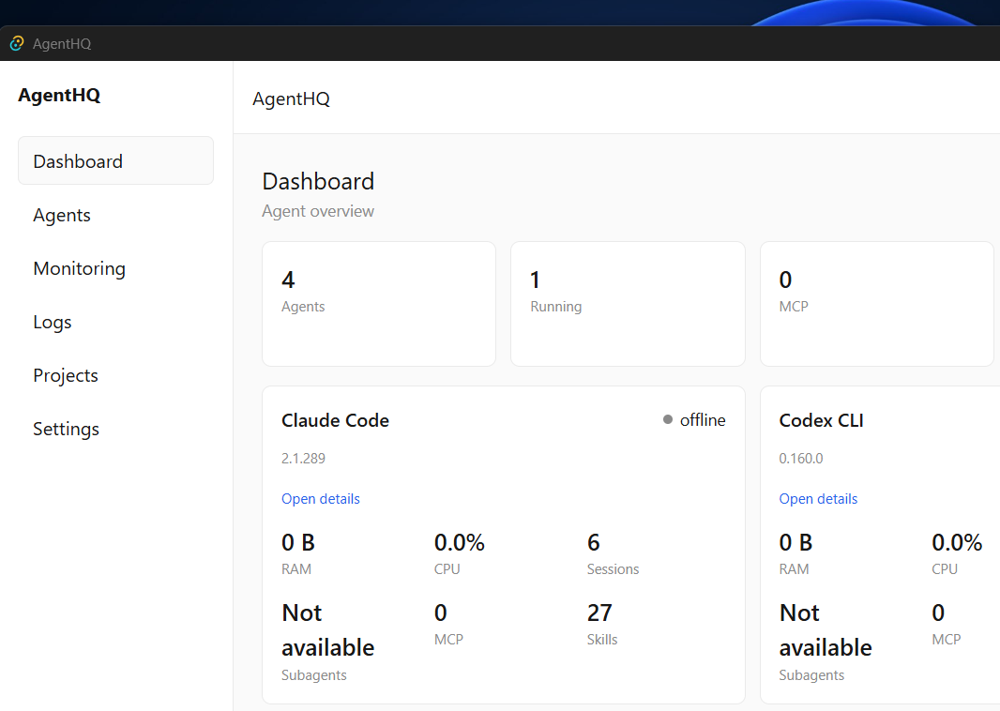

<div align="center">

# AgentHQ

**One calm window for every AI coding agent on your PC.**

Claude Code · OpenCode · Codex CLI · Grok CLI — installed or running, sessions, projects,
CPU/RAM, MCP, skills, plugins, models. Live, local, private.

[](LICENSE)
[](https://github.com/realmjunaid/agenthq/releases)
[](#-install-windows)
[](https://tauri.app)
[](https://react.dev)
[](https://www.rust-lang.org)




_No cloud. No accounts. No telemetry. Everything below stays on your machine._

</div>

---

## 📖 Contents

- [Why AgentHQ](#-why-agenthq)
- [Features](#-features)
- [Supported agents](#-supported-agents)
- [Install (Windows)](#-install-windows)
- [Using it](#-using-it)
- [Development](#%EF%B8%8F%EF%B8%8F-development)
- [Privacy](#-privacy)
- [FAQ](#-faq)
- [Roadmap](#%EF%B8%8F-roadmap)
- [Contributing](#-contributing)
- [License](#-license)

---

## 💡 Why AgentHQ

If you run more than one AI coding agent, you already know the mess: each CLI keeps its own sessions, skills, plugins and projects in its own hidden folders, and none of them tells you what it's doing right now. AgentHQ is the missing mission control — it reads those local folders directly and answers, at a glance:

> _Which agents do I have? Which are running? What are they working on, and how much machine are they eating?_

---

## 🪶 Lightweight, on purpose

No Electron, no background server, no bundled browser — Tauri renders with the system's WebView2, the backend is a single native binary, and the whole installer is **~3 MB**. Measured on the release build (Windows 11, 12-core, app idle):

| Metric | Measured | Budget |
|---|---|---|
| Installer (setup.exe) | ~2.3 MB | — |
| Startup (process start → visible window) | 802 ms | < 2 s |
| Idle CPU (10 s sample) | 0% | < 1–2% |
| Idle RAM (working set / private) | 31 / 10 MB | < 150 MB |

How it stays light: one aggregated IPC call per dashboard load (never one call per card), monitoring ticks only while the Monitoring page is open, paused monitoring skips all sysinfo refreshes, command lines capped at 512 chars, transcripts scanned with line caps, no file watching beyond three known config dirs, no rayon/thread pools. Method + raw numbers: [`docs/performance.md`](docs/performance.md).

---

## ✨ Features

- **📊 Dashboard** — agent cards with live CPU/RAM, session counts, MCP/skill totals, plus a recent-activity feed that updates itself over a local event bus.
- **🤖 Agents & detail pages** — status (installed / offline / running), version, and per-agent tabs: Overview, Sessions, Processes (indented tree), MCP, Skills, Plugins, Models, Logs, Configuration — with an inspector panel on the side.
- **📈 Monitoring** — system CPU/RAM/disk/network bars plus a per-agent resource table. Ticks every 2 seconds, only while the page is open.
- **🧾 Logs** — every local event with level filters and search (`Ctrl+K`).
- **📁 Projects** — the directories agents work in, one click to open.
- **🔔 Tray & notifications** — agent status in the system tray, close-to-tray, start-with-Windows, launch-minimized. Agent/model events and rising-edge high CPU/RAM alerts, each toggleable.
- **▶️ Lifecycle** — Start / Stop / Restart / Open Terminal, always behind a confirm dialog, and only ever aimed at processes whose executable matches the agent.
- **👁️ File watcher** — edit an agent config and the UI picks it up by itself (known config dirs only, debounced — never a disk scan).
- **🌗 Dark mode**, keyboard navigation, reduced-motion support, `Unknown` / `Not available` anywhere data can't be proven — never invented numbers.

---

## 🤖 Supported agents

| Agent | Install | Version | Processes | Sessions | MCP | Skills | Plugins | Models | Connections |
|---|---|---|---|---|---|---|---|---|---|
| Claude Code | ✅ | ✅ | ✅ | ✅ | ✅ | ✅ | ✅ | ✅ | env key names only |
| OpenCode | ✅ | ✅ | ✅ | ✅ | ✅ | ✅ | ✅ | ✅ | — |
| Codex CLI | ✅ | ✅ | ✅ | ✅ | ✅ | ✅ | ✅ | ✅ | — |
| Grok CLI | ✅ | ✅ | ✅ | ✅ | ✅ | ✅ | ✅ | ✅ | — |

Agents that aren't installed simply don't appear. Subagents read `Not available` everywhere — no adapter today exposes a countable source, and AgentHQ would rather say so than guess.

---

## 📥 Install (Windows)

**Requirements:** Windows 10/11 x64 · [WebView2 runtime](https://developer.microsoft.com/en-us/microsoft-edge/webview2/) (built into Windows 11).

1. Open [**Releases**](https://github.com/realmjunaid/agenthq/releases) and download **`agenthq_0.1.0_x64-setup.exe`** (or the `.msi`).
2. Run it. Windows SmartScreen will warn because the binary isn't code-signed (see [FAQ](#-faq)) — click _More info → Run anyway_.
3. Launch **AgentHQ** from the Start menu. Detection runs on its own; install any supported agent and its card shows up after a Refresh.

> No published build for your case? [Build from source](#%EF%B8%8F%EF%B8%8F-development): `npm run tauri build` → installer lands in `agenthq/src-tauri/target/release/bundle/`.

---

## 🧭 Using it

- **Dashboard** is home: totals on top, one card per installed agent, activity below. **Refresh** re-detects everything.
- Click **Open details** on any card for its sessions, process tree, MCP servers, skills, plugins, models and logs.
- **Monitoring** for the machine-wide picture, **Logs** (`Ctrl+K` to search) for what just happened, **Projects** to jump into folders.
- **Settings** controls the tray (start-with-Windows, close-to-tray, launch-minimized), monitoring pause, and every notification type.
- Close the window and the app keeps living in the tray — **Exit** from the tray menu quits for real.

---

## 🛠️ Development

### Prerequisites (Windows)

1. **Rust** (stable, MSVC): `winget install --id Rustlang.Rustup -e`, target `x86_64-pc-windows-msvc`.
2. **VS Build Tools 2022** with the C++ workload. The Rust linker must be on `PATH` in every Rust shell:
   ```powershell
   $env:Path = "C:\Program Files (x86)\Microsoft Visual Studio\2022\BuildTools\VC\Tools\MSVC\14.44.35207\bin\Hostx64\x64;" + $env:Path
   ```
   (The `14.44.*` folder varies — use whatever sits under `...\VC\Tools\MSVC\`.)
3. **Node 24 + npm** (npm only — there are no pnpm files here).
4. **WebView2** (see above).

### Commands

```bash
cd agenthq
npm install          # frontend deps

npm run dev          # Vite frontend only
npm run tauri dev    # full desktop app (debug)

npm run build        # frontend production build
npm test             # frontend tests (vitest)
npx tsc --noEmit     # frontend typecheck
```

```bash
cd agenthq/src-tauri
cargo test --lib     # Rust tests (linker PATH from step 2 first)
cargo check          # must finish with zero warnings
cargo fmt            # formatter
```

```bash
cd agenthq
npm run tauri build  # release MSI + NSIS setup → src-tauri/target/release/bundle/
```

> On some machines Windows application-control blocks `cargo test --bin agenthq`; the gate is `cargo test --lib` — every test lives in the lib target.

### How it works (60 seconds)

On every launch and Refresh, the Rust core (1) finds executables via `PATH` + known install dirs with timeout-guarded `--version` calls, (2) matches running processes by executable stem — a missing exe path never matches, its own PID is always excluded, (3) parses local configs/transcripts into SQLite (`env` blocks contribute **names and counts only**), and (4) emits transition events only on real change. The React UI reads it all over Tauri IPC — one aggregated call per dashboard load.

Agent-specific knowledge lives in exactly one place: `agenthq/src-tauri/src/agents/<agent>/` (trait + manager + `paths`/`parser`/`adapter` + hand-written fixtures). A new agent is a new folder plus one registration line. See [`docs/agent-research.md`](docs/agent-research.md) (per-agent verified sources), [`docs/architecture.md`](docs/architecture.md), and [`MASTER_PLAN.md`](MASTER_PLAN.md) (the original build spec).

---

## 🔒 Privacy

- **Local-only.** No accounts, no analytics, no crash uploader, no background server. The SQLite database lives in your app-data folder and nowhere else.
- **Secrets are never collected.** API keys, OAuth tokens, `auth.json` files and secret env values have *no reader anywhere* — tests pin their absence with canary values. Settings contribute names/counts, never values.
- **Minimum permissions.** The Tauri capability grants the UI event-subscribe + file-opener and nothing else (runtime-verified on the release build).
- **No fabrication.** Unverifiable data renders as `Unknown` / `Not available`, never as invented zeros.

---

## ❓ FAQ

**I installed it but no agents show up.**
Install at least one supported agent (table above), then hit **Refresh** on the dashboard. Portable/odd-path installs are found via `PATH` too — open a terminal and check `where.exe claude` (or `opencode`, `codex`, `grok`).

**Windows says the app is from an unknown publisher.**
Expected: releases are built locally, not code-signed (certificates cost money). The code is MIT and fully auditable — or build it yourself with the steps above.

**Something shows `Unknown` / `Not available`.**
That's honesty, not a bug: the agent doesn't expose that datum in any readable local form, so AgentHQ refuses to invent it. [Open an issue](https://github.com/realmjunaid/agenthq/issues) if you know a safe local source.

**Where is my data?**
`%APPDATA%\com.agenthq.app\agenthq.db` (SQLite). Delete the folder to reset everything. It never leaves the PC.

**Does it work on macOS/Linux?**
Not today — Windows 10/11 x64 only (process APIs, tray, registry autostart and installers are all Windows-shaped).

---

## 🗺️ Roadmap

- Gemini CLI + more adapters (the architecture makes these cheap)
- Token usage / cost tracking · MCP & skill management · automatic recovery
- Community adapter system

`MASTER_PLAN.md` §44 holds the full V2–V5 sketch.

---

## 🤝 Contributing

1. Fork + branch. Small modules; UI logic in React, OS logic in Rust, agent specifics inside adapters.
2. TDD: failing test first (`cargo test --lib`, `npm test`), watch it fail, then implement.
3. Before pushing: `cargo fmt` · `cargo check` (zero warnings) · `cargo test --lib` · `npm test` · `npx tsc --noEmit` · `npm run build`.
4. Never commit secrets, `.db` files, `target/`, or `node_modules/`.

---

## 📄 License

MIT — see [LICENSE](LICENSE). Free for personal and commercial use.
